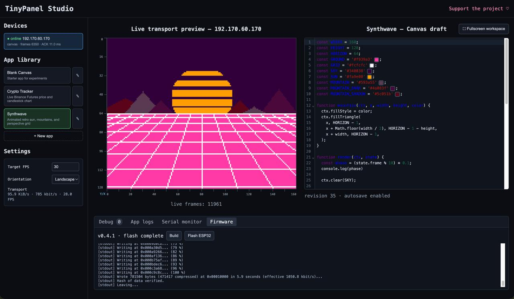
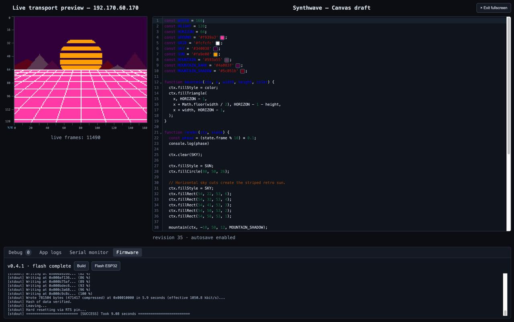

# TinyPanel Studio

TinyPanel Studio is an open-source platform for building, flashing, and
streaming Canvas apps to ESP32 displays. Configure hardware, manage apps, edit
code live, preview changes instantly, and debug devices from your browser.

The ESP32 acts as a thin display client. Applications run on the server and
send compact RGB565 updates over one ACK-controlled TCP connection, so most UI
changes appear on the panel without reflashing it.

## Screenshots

### Device Studio workspace



### Fullscreen editor and preview



## Current features

- Browser-based app library and CodeMirror editor with live updates
- Hybrid Canvas renderer with compact vector commands and RGB565 fallback
- JPEG video-frame transport and ESP32-side streaming decode
- Built-in Crypto Tracker, Synthwave, and blank starter apps
- Exact browser preview of the bytes sent to the display
- Optional transfer-rate diagnostics and serial monitor
- Versioned PlatformIO firmware builds and browser-triggered flashing
- Legacy vector and HTML screenshot renderers for comparison

The currently validated hardware target is an ESP32-C3 Super Mini with a
160x128 ST7735S SPI display. More controllers, panels, buses, and configurable
pin mappings are planned in [ROADMAP.md](./ROADMAP.md).

## Quick start

Requirements: Node.js 20+, npm, and PlatformIO for firmware build/flash tools.

```bash
npm ci
npm start
```

Open `http://localhost:8766`. The device stream listens on TCP port `8765`.
Selecting an app in the left sidebar switches the program rendered on connected
displays. The legacy Synthwave demo remains available with
`npm run start:synthwave`.

Run the generated video test stream (requires `ffmpeg`) with:

```bash
npm run start:video
```

Set `DISPLAY_VIDEO_SOURCE` to a local video file, camera input understood by
ffmpeg, or a network stream URL to replace the generated test pattern.

For the ESP32, copy `firmware/display-client/secrets.h.example` to
`firmware/display-client/secrets.h`, enter the Wi-Fi credentials, and set the
server's LAN address in `display_client.ino`. Then build and upload:

```bash
cd firmware/display-client
pio run -e esp32-c3-super-mini -t upload
```

See the [server guide](./server/README.md),
[application JSDoc configuration](./docs/APP_JSDOC_CONFIG.md),
[firmware guide](./firmware/display-client/README.md), and
[wire protocol](./DISPLAY_PROTOCOL.md) for details.

## Support

If TinyPanel Studio is useful to you, you can support its development at
[donatello.to/hoxz](https://donatello.to/hoxz).

## License

[MIT](./LICENSE)
